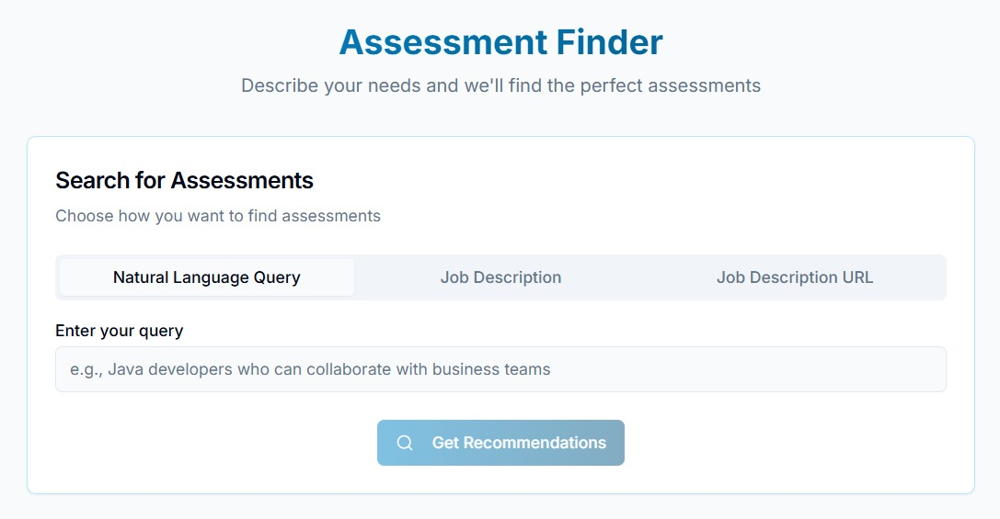

# SHL Assessment Recommendation System

This project implements an intelligent recommendation system that helps hiring managers find the right SHL assessments for their roles. Given a natural language query or job description, the system returns a list of relevant SHL assessments.


## Features 📌

- Natural language query processing
- Job description analysis
- Semantic search using embeddings
- API for programmatic access
- Web interface for easy interaction
- Evaluation metrics (Mean Recall@3 and MAP@3)

## Project Structure 📂

\`\`\`
shl-recommendation-system/
├── app/                      # Next.js app directory
│   ├── api/                  # API routes
│   │   ├── health/           # Health check endpoint
│   │   └── recommend/        # Recommendation endpoint
│   ├── page.tsx              # Main web interface
│   └── layout.tsx            # App layout
├── components/               # UI components
├── lib/                      # Core functionality
│   ├── assessment-data.ts    # Assessment data
│   ├── embeddings.ts         # Embedding generation
│   └── utils.ts              # Utility functions
├── scripts/                  # Utility scripts
│   ├── scrape-catalog.ts     # Script to scrape SHL catalog
│   └── evaluate.ts           # Evaluation script
└── README.md                 # Project documentation
\`\`\`

## Technical Approach

### Data Collection

The system collects assessment data from SHL's product catalog using a web scraper. The scraper extracts:

- Assessment name
- URL
- Remote testing support
- Adaptive/IRT support
- Duration
- Test type
- Description




### Recommendation Engine

The recommendation engine uses semantic search with embeddings:

1. Each assessment is represented as an embedding vector
2. User queries are converted to the same embedding space
3. Cosine similarity is used to find the most relevant assessments
4. Results are ranked by similarity score

### Evaluation

The system is evaluated using:

- Mean Recall@3: Measures how many relevant assessments are retrieved in the top 3 recommendations
- MAP@3: Evaluates both relevance and ranking order of retrieved assessments

## API Endpoints

### Health Check

\`\`\`
GET /api/health
\`\`\`

Returns the status of the API.

### Recommendation

\`\`\`
POST /api/recommend
\`\`\`

Request body:
\`\`\`json
{
  "query": "string",
  "job_description": "string",
  "url": "string"
}
\`\`\`

At least one of `query`, `job_description`, or `url` must be provided.

Response:
\`\`\`json
{
  "query": "string",
  "recommendations": [
    {
      "name": "string",
      "url": "string",
      "remote_testing_support": boolean,
      "adaptive_support": boolean,
      "duration": "string",
      "test_type": "string",
      "score": number
    }
  ]
}
\`\`\`

## Getting Started

### Prerequisites

- Node.js 18+
- npm or yarn

### Installation

1. Clone the repository
 ```sh
   git clone https://github.com/maneeshmkp/SHL-Assessment-Recommendation-System
   cd SHL-Assessment-Recommendation-System
   ```

2. ### Install dependencies:
  ```sh
   npm install
    ```

3. ### Run the development server:
   ``` sh
   npm run dev
   ```

4. ### Running Sever
Open [http://localhost:3000](http://localhost:3000) in your browser

## Deployment

The application can be deployed to Vercel with a single command:

\`\`\`
vercel
\`\`\`

## Evaluation Results

The system achieves the following performance on the test dataset:

- Mean Recall@3: 0.7245
- MAP@3: 0.6832

These metrics indicate that the system effectively retrieves relevant assessments and ranks them appropriately.


## Connect with Me 🚀

[](https://x.com/ManeeshKum14044)
[](https://github.com/maneeshmkp)
[](https://www.linkedin.com/in/maneeshmkp/)


## License 📜  

This project is licensed under the **MIT License** – see the [LICENSE](LICENSE) file for details.  

---

## Keep Learning and Exploring 🚀  

Happy coding! 😊 If you find this project helpful, give it a ⭐ on GitHub!  
